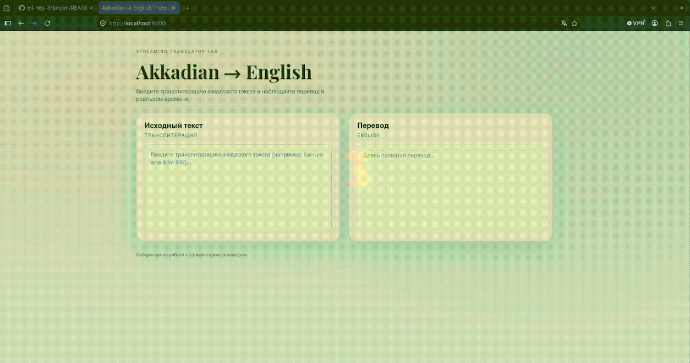

# Akkadian Machine Translation System

Комплексная система машинного перевода с аккадского языка на английский. Проект объединяет глубокое обучение (NMT), легковесный бэкенд для инференса и интерактивный веб-интерфейс.

## Структура репозитория

* `./backend` — API-сервис перевода на FastAPI (WebSocket).
* `./frontend` — Веб-интерфейс на Vanilla JS и Nginx.
* `./ml` — Модуль машинного перевода (ByT5-base, скрипты обучения и валидации).
* `./data` — Локальные логи, датасеты и медиа-файлы для документации.

---

## Demo



---

## Быстрый запуск (Backend + Frontend)

Для локального запуска веб-интерфейса и API-сервера используется Docker Compose. Перед запуском убедитесь, что веса модели находятся в директории `./backend/akkadian-model`.

### Запуск системы

```bash
docker compose up --build -d

```

После успешного запуска сервисы будут доступны по адресам:

* **Frontend:** `http://localhost:8000`
* **Backend API:** `ws://localhost:8080/translate`

### Остановка системы

```bash
docker compose down

```

---

## Компоненты системы

### 1. Backend (FastAPI)

Предоставляет асинхронный эндпоинт для перевода через протокол WebSocket.

* **Эндпоинт:** `ws://localhost:8080/translate`
* **Формат запроса:** `{"text": "um-ma kà-ru-um"}`
* **Особенности:** Поддерживает монтирование весов модели из внешнего контекста для экономии времени сборки Docker-образа.

### 2. Frontend (Vanilla JS & Nginx)

Интуитивный интерфейс для работы с переводчиком.

* **Оптимизация:** Реализован Debounce (650 мс), предотвращающий спам сервера запросами при вводе.
* **Реактивность:** При изменении ввода старое WebSocket-соединение сбрасывается (`abortActiveRequest`), и открывается актуальное. Результат стримится напрямую в блок вывода.

### 3. ML Part (ByT5-base NMT)

Модель машинного перевода, разработанная в рамках соревнования **Deep Past Initiative**.

* **Архитектура:** `ByT5-base` (byte-level, эффективен для диакритики `š/ṣ/ṭ/ā` без раздувания токенизатора).
* **Инсайт по данным:** Тестовый датасет искусственно искажен детерминированным шифром (`š→a`, `ṭ→m` и т.д.). Для компенсации применена test-style аугментация тренировочного корпуса.
* **Пайплайн:** Выравнивание +8k предложений из `Sentences_Oare_FirstWord_LinNum.csv` по первому слову. Группировка предложений в чанки по 1–5 для имитации распределения теста.
* **Результаты:** * Single model (ByT5-base seed13, beam=8): Kaggle Public **21.55** / Private **23.05**.
* Ensemble (seed13 + seed42 + MBR-chrF): Лучший офлайн результат на dev (geo-mean **27.30**, BLEU **19.03**).


---

## Подробная документация подсистем

Для глубокого погружения в настройку, конфигурацию экспериментов (W&B, Hugging Face Hub) или запуск CLI-команд обучения перейдите в README соответствующих модулей:

* [Инструкция по Backend](https://www.google.com/search?q=./backend/README.md)
* [Инструкция по Frontend](https://www.google.com/search?q=./frontend/README.md)
* [Инструкция по ML-части (Воспроизведение и сабмит)](https://www.google.com/search?q=./ml/README.md)

```
