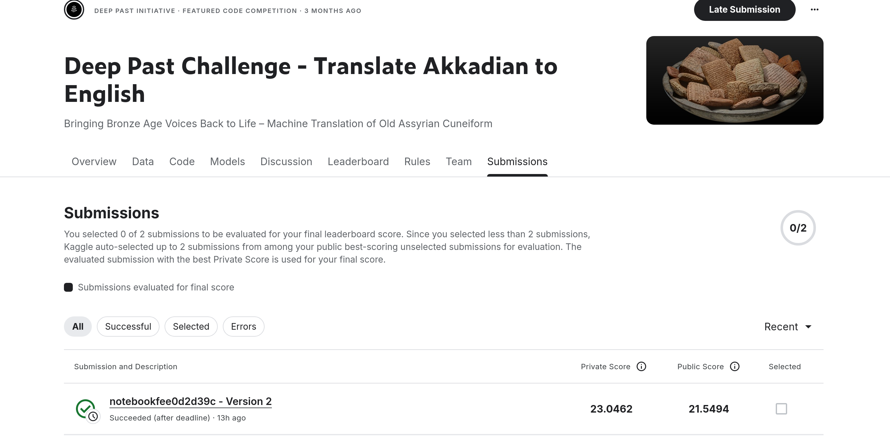
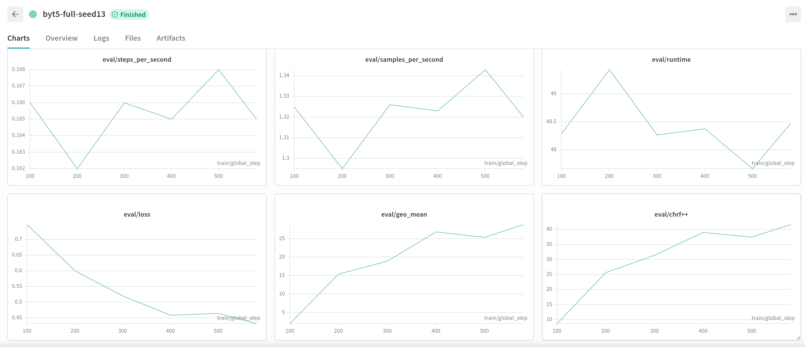

# Akkadian → English NMT — ML part (HW3, Deep Past Initiative)

1. **Тест испорчен детерминированным посимвольным шифром** (артефакт шрифта публикаций):
   `š→a`, `ṭ→m`, `ḫ→+`, `4→„`, `5→…`, `{}→()`. Шифр необратим, поэтому мы не чистим тест,
   а **аугментируем train-источник тем же шифром** (`akkadian_nmt/normalize.py`).
2. **+8k пар на уровне предложений** добываются из `Sentences_Oare_FirstWord_LinNum.csv`
   выравниванием по первому слову (85% текстов выравниваются полностью), источник
   транслитераций — `published_texts.csv`. Всё из официального датасета соревнования.
3. Тестовые примеры — диапазоны строк таблички, поэтому предложения группируются
   в чанки по 1–5, имитируя распределение длин теста.

Модель: **ByT5-base** (byte-level — диакритика `š/ṣ/ṭ/ā` и индексы знаков `bi₄`
обрабатываются без токенизатора). Обучение — Colab T4: fp32 (T5 нестабилен в fp16),
gradient checkpointing, Adafactor, возобновление с чекпоинта после обрыва сессии.

## Results (ablation)

dev-метрики считаются на **испорченном** dev (`src_test_style`) — это прокси под
зашифрованный тест Kaggle (см. инсайт 1). Исключение — baseline, обученный на raw,
его dev меряется на чистом источнике.

| # | Техника | BLEU (dev) | chrF++ (dev) | geo-mean (dev) | Kaggle public LB | Примечания |
|---|---------|-----------:|-------------:|---------------:|-----------------:|------------|
| 0 | Baseline: ByT5-base, train.csv (доки), raw орфография, greedy | 14.75 | 35.54 | 22.90 | **13.08** | dev на чистом источнике; `configs/baseline.yaml` |
| 1 | + нормализация орфографии и test-style аугментация (docs, greedy) | 17.20 | 37.07 | 25.25 | — | `configs/exp1_norm.yaml` |
| 2 | + sentence-chunk пары (полный корпус, seed13, greedy) | 17.66 | 37.71 | 25.81 | — | `configs/exp2_full_seed13.yaml` |
| 3 | + beam search (seed13, beam=8) | 18.22 | 38.25 | **26.40** | 21.55 / 23.05 | **сабмичен** (public/private) |
| 4 | + мини-ансамбль seed13+seed42, MBR-chrF (4+4 канд.) | **19.03** | **39.16** | **27.30** | — | лучший на dev |

Beam sweep (испорченный dev, 200 примеров):
- exp1 (docs): greedy 25.25 → beam4 **25.64** → beam8 25.54
- exp2 (seed13, full): greedy 25.81 → beam4 26.19 → beam8 **26.40** (монотонно)
- exp3 (seed42, full): greedy 25.28 → beam4 **25.47** → beam8 25.23

Каждая обязательная техника даёт прирост на распределении теста: нормализация+шифр
(baseline LB 13.08 → exp1 dev geo 25.25), +chunk-данные (25.25 → 25.81 greedy),
+beam search (25.81 → 26.40). Ансамбль seed13+seed42 — строка 4.

Ансамбль (MBR-chrF над пулом beam-кандидатов двух сидов) бьёт лучшую одиночную
модель на dev: geo 26.40 → **27.30**.

**Финальные метрики:**
- **Сабмит (ByT5-base seed13, beam):** Kaggle public **21.55** / private **23.05**.
- dev (испорченный, n=200): лучшая одиночная geo **26.40**; ансамбль BLEU **19.03**,
  chrF++ **39.16**, geo **27.30**, COMET (`Unbabel/wmt22-comet-da`) **0.6331**.



Кривые обучения (run `byt5-full-seed13`): eval/loss, eval/geo_mean, eval/chrf++ и др.



Полные графики и метрики — в W&B:
[wandb.ai/kmalahov703-tomsk-state-university/akkadian-nmt](https://wandb.ai/kmalahov703-tomsk-state-university/akkadian-nmt).

## Данные и лицензии

| Источник | Объём | Использование | Лицензия |
|---|---|---|---|
| Kaggle `train.csv` | 1561 док-пар | обучение | правила соревнования (Deep Past Initiative / OARE) |
| Kaggle `Sentences_Oare_FirstWord_LinNum.csv` | 9782 предложения | +2.5k чанк-пар после выравнивания | те же (входит в датасет соревнования) |
| Kaggle `published_texts.csv` | 7953 транслитерации | источник для выравнивания | те же |

Внешние корпуса не использовались. **Контроль утечки:** табличка видимого теста (AKT 5 1)
и все её дубликаты-копии (31 текст, циркулярное письмо существует во многих копиях)
исключены из обучения поиском по содержимому; train/dev разбиты по id текста;
точные дубликаты источника между train и dev удалены (`akkadian_nmt/data_prep.py`,
проверки в `data/processed/stats.json`).

## How-to

```bash
cd ml
poetry install                  # или: pip install -e .
# данные соревнования положить в ml/data/ (kaggle competitions download -c deep-past-initiative-machine-translation)
```

### Подготовка корпуса
```bash
poetry run python -m akkadian_nmt.data_prep --data_dir=./data --out_dir=./data/processed
```

### Обучение (Kaggle Notebooks — рекомендуется, GPU T4)
Открыть `notebooks/kaggle_train.ipynb`, выставить `CONFIG`, `TRAIN=True`, Accelerator
**GPU T4** (НЕ P100 — текущий PyTorch не поддерживает Pascal/sm_60), Internet On,
секреты `HF_TOKEN` + `WANDB_API_KEY`, Input → датасет соревнования. Чекпоинты пушатся
на HF Hub (резюм после обрыва автоматический), веса пишутся в `/kaggle/temp` чтобы не
раздувать output. Аналог для Colab — `notebooks/colab_train.ipynb`.

### Обучение (CLI, если есть GPU)
```bash
poetry run python model.py train --dataset=./data/train.csv          # = exp2-конфиг
poetry run python -m akkadian_nmt.train --config=configs/baseline.yaml
```

### Эксперименты
```bash
# beam sweep (эксперимент 2)
poetry run python -m akkadian_nmt.evaluate beam_sweep --model_dirs=model/byt5-full-s13/final
# полный метрический набор + COMET
poetry run python -m akkadian_nmt.evaluate run --model_dirs=model/byt5-full-s13/final --num_beams=4 --comet=True
# ансамбль (эксперимент 3): пул кандидатов двух чекпоинтов + MBR-chrF
poetry run python -m akkadian_nmt.evaluate run \
  --model_dirs='["model/byt5-full-s13/final","model/byt5-full-s42/final"]' \
  --num_beams=4 --candidates_per_model=4
```

### Перевод (локально)
```bash
poetry run python model.py predict --text="um-ma kà-ru-um kà-ni-iš-ma" # стримит токены
poetry run python model.py predict-file --dataset=./data/test.csv      # -> ./data/results.csv
```

### Сабмит на Kaggle (это **code competition**)
Сабмитится не файл, а ноутбук: Kaggle приватно перезапускает выбранную версию,
подставляя скрытый тест, и забирает из Output файл **`submission.csv`**.
Интернет при перезапуске **выключен**, поэтому `notebooks/kaggle_submit.ipynb` —
самодостаточный (вшиты нормализация + MBR-chrF), модели берутся из подключённых
Kaggle Dataset (готовятся `notebooks/kaggle_export_model.ipynb` из весов на HF Hub):
1. Add Input → соревнование + датасет(ы) с моделью; Internet **Off**, GPU **T4**.
2. Шаг 1 печатает пути моделей → впиши в `MODEL_DIRS`; `NORMALIZE=True` для exp1+.
3. Save & Run All → `submission.csv` в Output → **Submit**.

## Конфигурация декодирования (финальная)

- **Сабмит:** одна модель ByT5-base seed13, beam search `num_beams=8`,
  `max_new_tokens=512`, нормализация входа включена.
- **Лучшая офлайн-конфигурация:** ансамбль seed13 + seed42 — по 4 beam-кандидата
  (`num_beams=4`, `num_return_sequences=4`) с каждой модели → пул из 8 → выбор консенсуса
  через MBR по chrF (reference-free, `akkadian_nmt/decode.py::mbr_select`).

## Логи и трекинг

- Все стадии пишут в `./data/log_file.log` (singleton-логгер `akkadian_nmt/logging_utils.py`).
- Эксперименты: W&B, проект `akkadian-nmt`
  (`https://wandb.ai/kmalahov703-tomsk-state-university/akkadian-nmt`).
- Веса: HF Hub — `kirmala/akkadian-byt5-full-seed13`, `...-seed42`,
  `...-byt5-norm-docs`, `...-byt5-baseline-docs-raw`.

